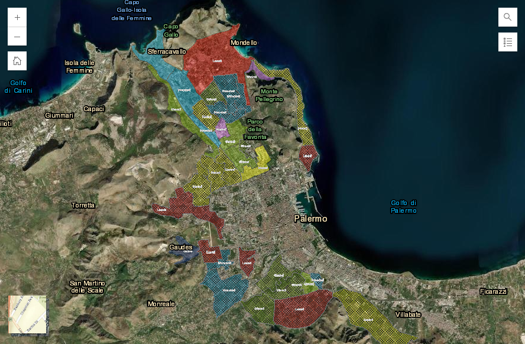

# Palermo, dal 2 dicembre 2024 un nuovo piano di razionamento idrico per la città di Palermo

A partire dal **2 dicembre**, Amap estenderà il piano di razionamento idrico a **Palermo**, coinvolgendo **ulteriori 100.000 abitanti**. Il provvedimento si rende necessario a causa del drastico calo delle riserve idriche, che a metà novembre risultano ridotte di oltre il 70% rispetto allo stesso periodo del 2023. Le piogge autunnali, concentrate sulle zone costiere, non hanno avuto un impatto significativo sugli invasi, i cui livelli continuano a calare.

Con le nuove misure, saranno 250.000 i cittadini sottoposti a razionamento. Le sospensioni dell'erogazione interesseranno i distretti centro-settentrionali, escludendo temporaneamente le aree con grandi utenze pubbliche come ospedali e stazioni. La distribuzione sarà interrotta per 24 ore consecutive, dalle 8:00 di un giorno alle 8:00 del successivo, con possibili disagi e un incremento temporaneo della torbidità alla riapertura.

Qui il comunicato ufficiale di [Amap SpA](https://www.amapspa.it/it/30443/).

<!-- more -->

