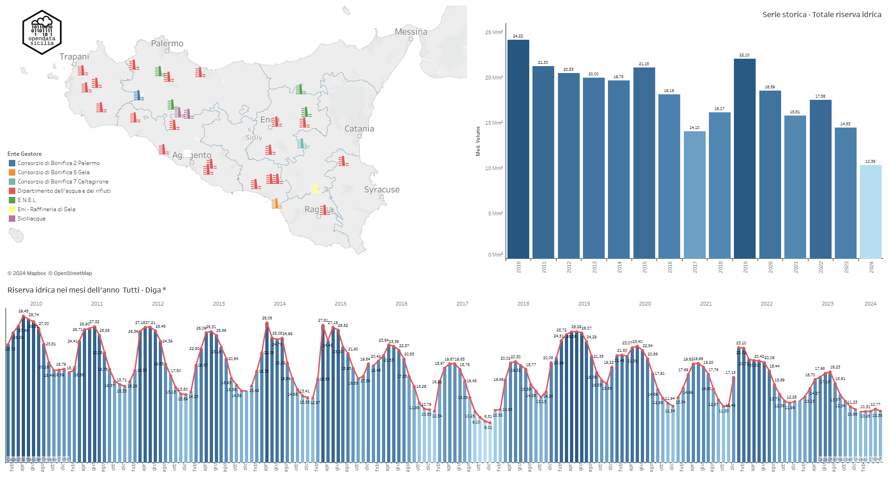

# Aggiormamento dati volumi invasati maggio 2024

A fine maggio 2024 l'[Autorità di Bacino del Distretto Idrografico della Sicilia](https://www.regione.sicilia.it/istituzioni/regione/strutture-regionali/presidenza-regione/autorita-bacino-distretto-idrografico-sicilia) ha pubblicato i [dati](https://www.regione.sicilia.it/istituzioni/regione/strutture-regionali/presidenza-regione/autorita-bacino-distretto-idrografico-sicilia/volumi-invasi-anno-2024) (tabelle e grafici in formato pdf) sui Volumi invasati nelle dighe della Sicilia.  

Nonostante le piogge del mese di maggio, (dati del [Servizio Agrometeorologico Siciliano SIAS](http://www.sias.regione.sicilia.it/)) non diminuisce la perdita di volume di acqua negli invasi.

<!-- more -->

“a fine maggio le precipitazioni accumulate in Sicilia negli ultimi 12 mesi con una media regionale di 453 mm, sono scese sotto la soglia psicologica di 500 mm medi, valore che non si registrava dalla grande siccità del 2002, quando nello stesso periodo l’accumulo medio risultava essere stato di 415 mm”. Spiccano le aree della regione, principalmente nella Sicilia centro-orientale e sulla fascia centro-meridionale, dove gli accumuli annuali sono inferiori a 300 mm, con deficit che arrivano a superare il 60% a livello annuale, come a Catania, dove con soli 240 mm caduti in un anno, mancano all’appello oltre 400 mm di pioggia.
 
[Servizio Agrometeorologico Siciliano SIAS](http://www.sias.regione.sicilia.it/)

[Consulta i dati relativi ai volumi invasati nelle dighe Siciliane dal 2010 a maggio 2024](../../../../../mappe/volumi/)

## Dati [Autorità di Bacino del Distretto Idrografico della Sicilia](https://www.regione.sicilia.it/istituzioni/regione/strutture-regionali/presidenza-regione/autorita-bacino-distretto-idrografico-sicilia)

-   __Prospetto volumi invasi mese di Maggio 2024__

    ---
     [")](https://www.regione.sicilia.it/sites/default/files/2024-04/1__2024.04.01_A_Tabella_volumi_invasi_0.pdf) 
	 
    [:octicons-arrow-right-24: Scarica allegato](https://www.regione.sicilia.it/sites/default/files/2024-05/1__2024.05.01_A_Tabella_volumi_invasi_0.pdf)

-   __Grafico volumi invasi mese di Maggio 2024__

    ---
	 [")](https://www.regione.sicilia.it/sites/default/files/2024-04/0__2024.04.01_C_Grafici_volumi_invasi_0.pdf) 
	

    [:octicons-arrow-right-24: Scarica allegato](https://www.regione.sicilia.it/sites/default/files/2024-05/0__2024.05.01_C_Grafici_volumi_invasi_0.pdf)

