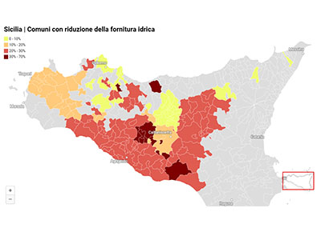
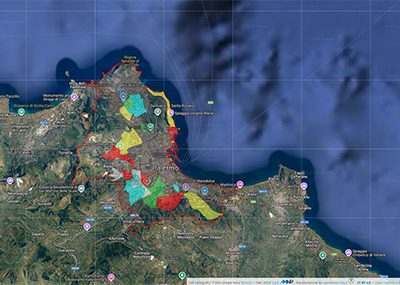
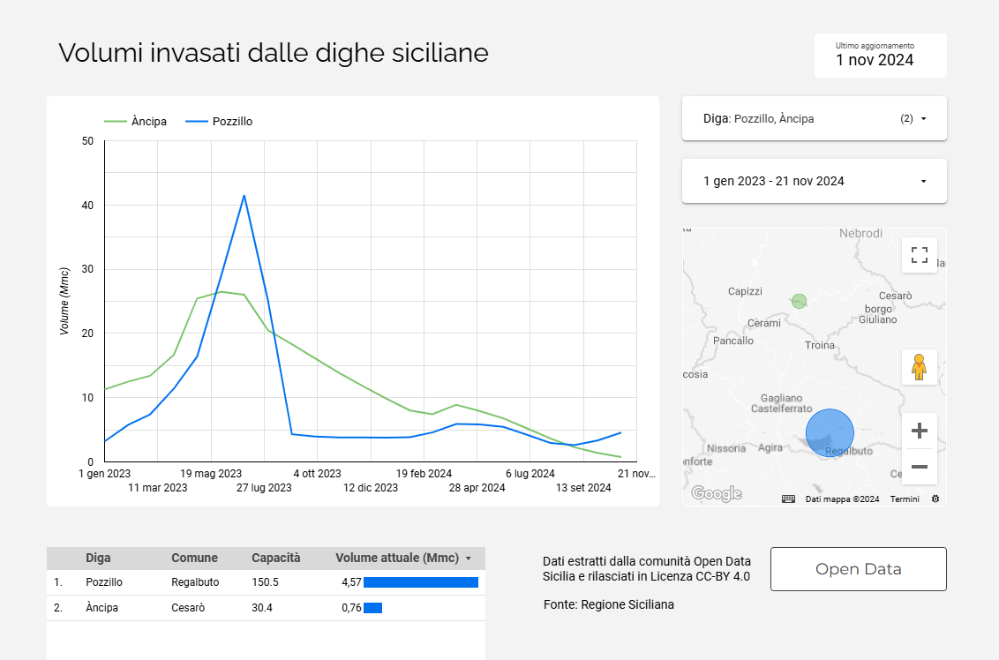

---
hide:
- toc
# - navigation
title: Mappe e Tabelle
description: Mappe e Tabelle by @opendatasicilia
---

# Mappe

-   __Palermo riduzione 2 dicembre 2024__

    ---

	

    [:octicons-arrow-right-24: Apri](distretti_pa_2_dicembre_2024/index.md "Palermo riduzione 2 dicembre 2024")

-   __Palermo riduzione 7 ottobre 2024__

    ---

	

    [:octicons-arrow-right-24: Apri](distretti_pa/index.md "Palermo riduzione 7 ottobre 2024")

-   __Comuni con riduzione della fornitura idrica__

    ---

    

    [:octicons-arrow-right-24: Apri](riduzione/index.md "Comuni con riduzione della fornitura idrica")

-   __Dighe e prospetto dei volumi invasati__

    ---

    

    [:octicons-arrow-right-24: Apri](volumi/index.md "Dighe e prospetto dei volumi invasati")

-   __Principali risorse idriche in Sicilia__

    ---

    

    [:octicons-arrow-right-24: Apri](risorse/index.md "Principali risorse idriche in Sicilia")

-   __Grandi dighe Italiane__

    ---

    

    [:octicons-arrow-right-24: Apri](grandi_dighe/index.md "Grandi dighe Italiane")

-   __Regalbuto distretti rete idrica AcquaEnna__

    ---

    

    [:octicons-arrow-right-24: Apri](../tabelle/distretti_regalbuto.md "Regalbuto distretti rete idrica AcquaEnna")

-   __Regalbuto distretti rete idrica AcquaEnna__

    ---

    

    [:octicons-arrow-right-24: Apri](regalbuto/regalbuto_turnazione.md "Regalbuto distretti rete idrica AcquaEnna")

-   __Palermo turnazione idrica - AMAP SpA__

    ---

    

    [:octicons-arrow-right-24: Apri](distretti_pa_turnazione/index.md "Palermo, dal giorno 7 ottobre scatta il piano di razionamento idrico: ecco la mappa dei distretti interessati")

-   __Dashboard dei volumi invasati nelle dighe siciliane__

    ---

    

    [:octicons-arrow-right-24: Apri](https://lookerstudio.google.com/reporting/241228ac-70d4-4861-88c7-a9058ab28a11/page/gPgUE "I volumi invasati dalle dighe siciliane")
